# Description
This code is an example for DRV2605 to vary the resonant frequencies of Linear Resonant Actuators(LRAs) based on Adafruit_DRV2605_Library[1].

With this code, you can easily render haptic feedback with different frequencies.

I've tested 1Hz, 5Hz, 10Hz, 20Hz, and 50Hz haptic feedback, and all of them work well.

However, the vibrotactile feedback feels like continuous feedback if the driving frequency is more than about 20Hz.

## License

**MIT license**

You have to include the GitHub repository in any redistribution.

For academic usage, please cite this repository if possible.
```
@MISC {DRV2605_Freq_Control,
    title   = "Variable-LRA-Frequencies-on-DRV2605",
    url     = "https://github.com/Solla/Variable-LRA-Frequencies-on-DRV2605",
    year =  "2021",
    author = "Solla"
}
```

## Development Boards

**This code is only for ESP32-based development boards.**

Here I use ESP32 (Nodemcu-32s) since it is capable of simulating 40MHz PWM signals.

DRV2605 requires **10-250kHz** PWM signals for modulating the resonant frequencies of LRAs.

Common development boards cannot produce high-frequency PWM signals, such as Arduino (Default: 1000/500Hz) and ESP8266 (Default: 1000Hz).

If the DRV2605 receives an 1000Hz PWM signal, the frequencies of LRAs will be only **7.8125Hz**.

## How it works

### Disable the resonance frequency calibration of DRV2605
From the datasheet[2], we can see how to disable the resonance frequency calibration of DRV2605 on Page 14.

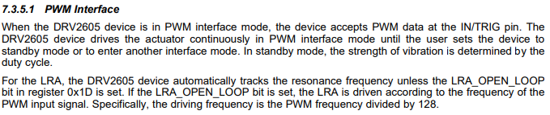

We have to set the LRA_OPEN_LOOP bit in register 0x1D and change to PWM/Analog Mode.

Code:
```
  drv.begin();
  drv.useLRA();
  drv.setMode(DRV2605_MODE_PWMANALOG);
  drv.writeRegister8(DRV2605_REG_CONTROL3, drv.readRegister8(DRV2605_REG_CONTROL3) | 0x01);
```

### Control the frequencies of LRAs

From the datasheet[2], we can see how to change the resonance frequencies of LRAs on Page 14.


The driving frequency is the PWM frequency divided by 128.

Thus, a 128Hz PWM signal means the LRA will be vibrated at 1Hz.

To modulate the frequencies of PWM signals on ESP32, please refer to the tutorial for ESP32[3].

(The frequency here is equal to alternating current (AC) frequency. Setting 1Hz implies two impulses per second, one positive and one negative force.)

Code:
```
void SetFreq(uint32_t Freq = Default_PWM_Frequency)
{
  //DRV2605 Input PWM Frequency: 10-250kHz
  assert (Freq <= 1950); //DRV2605 cannot support > 250kHz PWM signals
  assert (Freq != 0);   //DRV2605 cannot support < 10Hz PWM signals
  Freq *= 128;
  ledcSetup(0, Freq, 8);  //Clear PWM Signal
  ledcAttachPin(Motor_PWM_Pins, 0);
  ledcWrite(0, 1);
}
```

Note: It's weird that we cannot decrease the magnitude of vibration force by modulating the duty cycle of PWM signals.

### Varying the voltage of LRAs

From the datasheet[2], we can see the formula(5) for the output voltage of DRV2605 on Page 22.

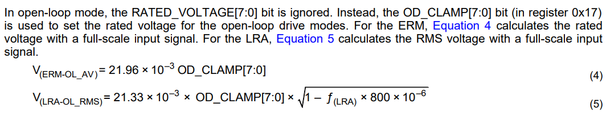

Code:
```
void SetMotorVoltage(uint8_t Fraction = 0x89)
{
  drv.writeRegister8(0x16, Fraction);	//For closed-loop, can ignore in this application.
  drv.writeRegister8(0x17, Fraction);	//For open-loop
}
```

## Precautions

### Why the I2C protocol of ESP32-based development boards doesn't work

Use two 4.7K pull-up resistors with 5V for both SDA and SCL.

## Demonstration

### LRA

We measure the force curves of NFP-ELV0832B [4].

### Load Cell
We used ZTS-20N to record the force of the LRA.
ZTS-20N features high sampling rate of 2000 Hz for accurate measurement, and the minimum unit of measurement is 0.01N.

### Configuration
Five frequencies: **1Hz, 2Hz, 10Hz, 20Hz, and 50Hz**

```
SetFreq(1);	//1Hz
SetFreq(2);	//2Hz
SetFreq(10);	//10Hz
SetFreq(20);	//20Hz
SetFreq(50);	//50Hz
```

Two magnitude: **20%(1V) and 100%(5V)**

```
SetMotorVoltage(50);  //20%
SetMotorVoltage(255); //100%
```

### Force Curves

**Note that the scales of the vertical axis might be different**

**You can see the raw data from [here](raw_force_curve).**

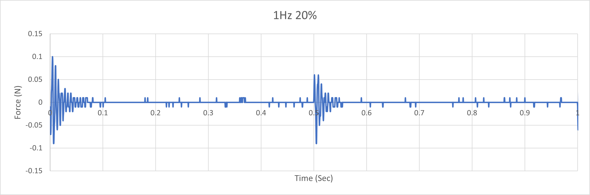
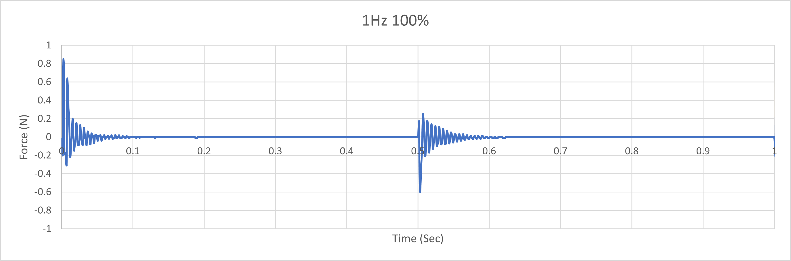
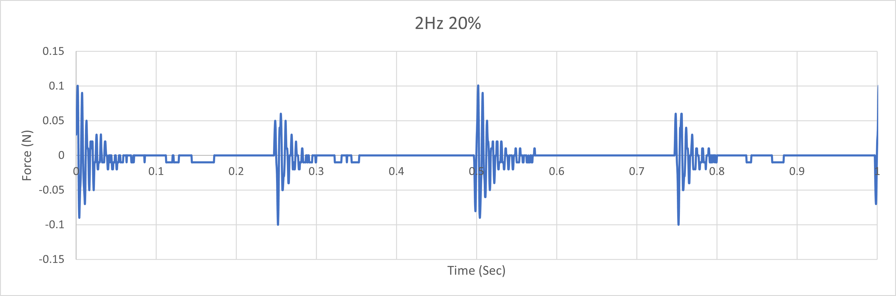
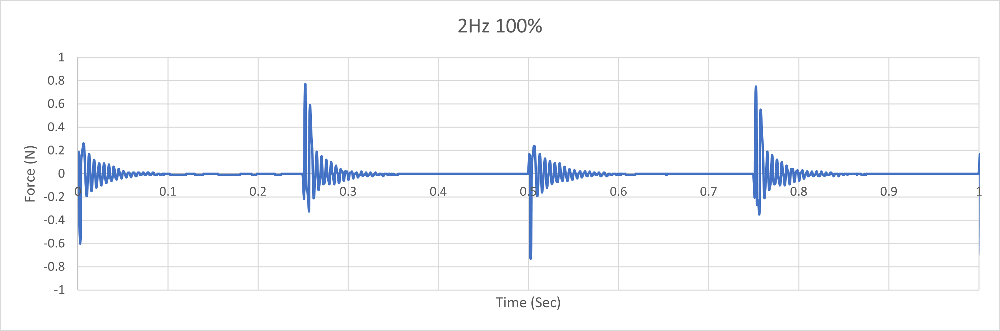

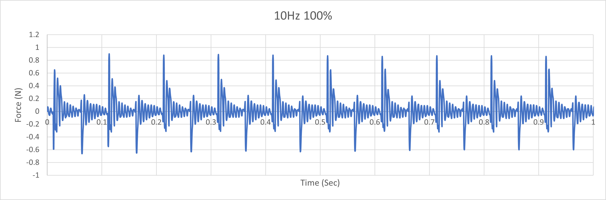
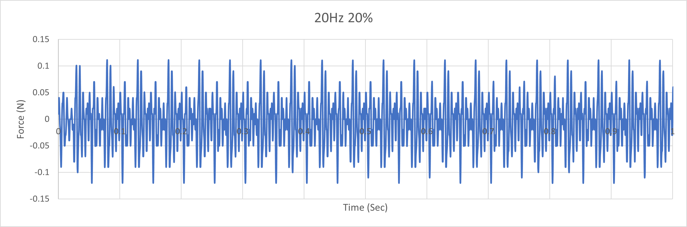
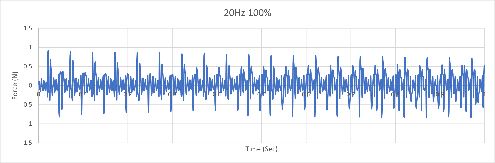
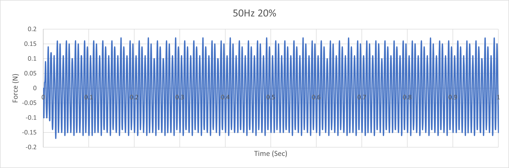
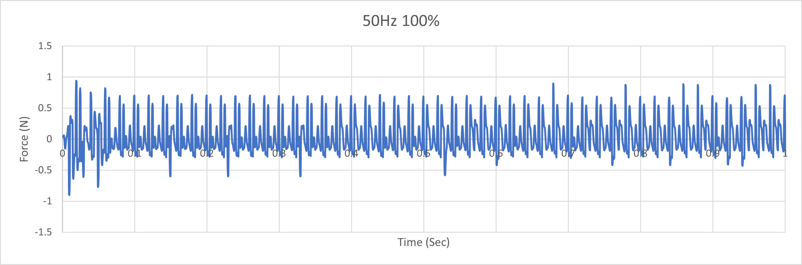

## Reference
[1] Adafruit_DRV2605_Library: https://github.com/adafruit/Adafruit_DRV2605_Library

[2] Datasheet : https://www.ti.com/lit/ds/symlink/drv2605.pdf

[3] How to use PWM on ESP32 : https://randomnerdtutorials.com/esp32-pwm-arduino-ide/

[4] LRA Motors : https://www.nfpmotor.com/products-linear-resonant-actuators-lras.html
